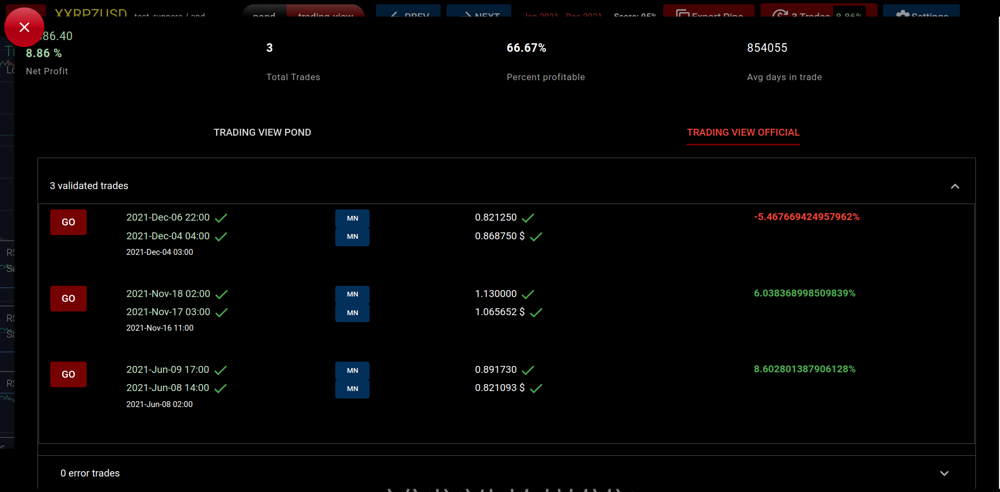
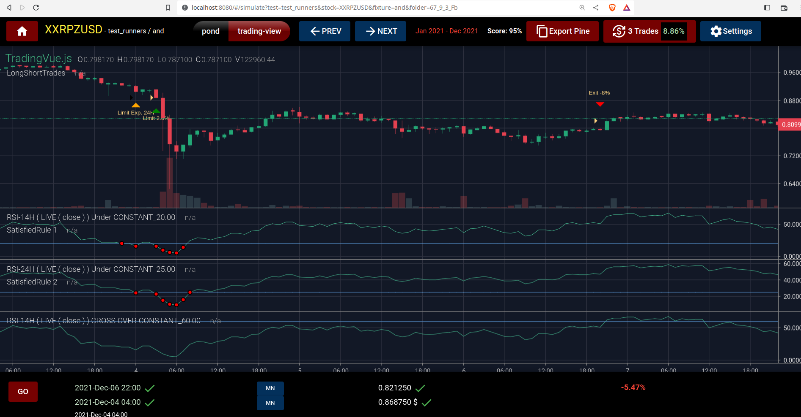

## A better clone of the tradingview chart solution


[Pine script custom implementation](https://www.tradingview.com/pine-script-docs/en/v5/Introduction.html) | [Unit tested Golang backend ](https://go.dev/) | [Trading Vue integration](https://github.com/tvjsx/trading-vue-js)

---

## Backend Features

- Unit tested backtest engine replicating Tradingview backtesting engine
- A custom order manager supporting pyramiding
- Support for infinite indicators
- Pinescript source code genetaion
- Built on the spcification pattern methodology

---



---



---

##### Yaml specification pattern language

<sub><sup> Enters the trade whith a 2% limit order when **RSI 14H of close is Under 20** *AND* **RSI 24H of close is Under 25**</sup></sub>

```yaml

enterConfig:
  limit: 2
  limitExpirationBars: 24
enterRule:
  name: and
  rules:
  - indicators:
    - RSI 14H < close
    - CONSTANT 20
    name: under
  - indicators:
    - RSI 24H < close
    - CONSTANT 25
    name: under
exitRule:
  crosser:
    crossType: ' CROSS OVER '
  indicators:
  - RSI 14H < close
  - CONSTANT 60
  name: cross
generator: and
initialEquity: 10000
overlay: true
pyramiding: 1
stockId: XXRPZUSD
strategyType: long
yearFrom: 2021
yearTo: 2021

```
---

## Performances and stability

- Most of the engine has been unit tested 
- Integration with TV CSV export for the calibration of the code to exactly replicate trading view backtesting engine
- Infinite combination of triggers and indicators with the logical operators `OR` `AND` and `XOR`
